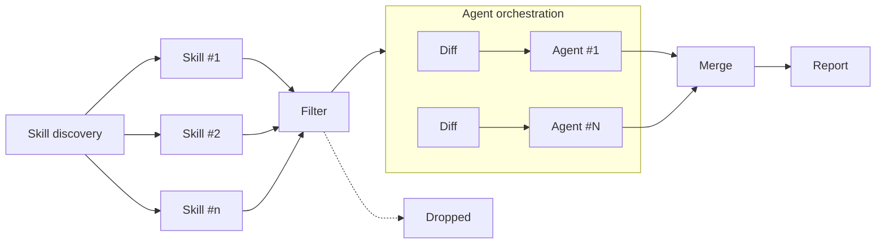

# Entmoot

Entmoot is a read-only, skill-driven review harness. It allows you to turn any skill in your project
into an individual agent to conduct a thorough review of the changes in your branch. Results are then
presented in your terminal or in your pull request.

For example, the following patch turns the `.agents/skills/bug-hunter/SKILL.md` into an agent
```diff
---
name: Bug Hunter
description: Finds concrete runtime defects, code that crashes, computes wrong results, or corrupts state
+entmoot:
+    mode: deep
---

[...]
```

Supported platforms are GitHub and Gitea, though any GitHub Actions compatible platform should work.


## Quickstart

```bash
# Initialize Entmoot in your project
npx github:volsa/entmoot init

# Review your changes in this branch
npx github:volsa/entmoot review
```


## GitHub Actions

On a pull request, Entmoot posts its findings as one new comment per run. Add either `ENTMOOT_OPENROUTER_API_KEY`
or `ENTMOOT_OPENAI_API_KEY` as a repository secret, which selects the provider. Everything else, including
[the workflow](.github/workflows/entmoot.yml), is scaffolded by `npx github:volsa/entmoot init`.

> [!NOTE]
> The `init` command does not exist yet. Until it does, copy the workflow file into your repository by hand.


## Safety

Being a read-only harness, Entmoot eliminates most attack vectors. Secret leakage, however, is still
possible. An external contributor could add an Entmoot review skill that instructs the agent to read and
include e.g. the `OPENAI_API_KEY` environment variable in its review. Another attack vector is resource
exhaustion, where an external contributor opens hundreds of pull requests to burn through your tokens.

Entmoot is defenseless against these sorts of attacks. It is therefore recommended to require explicit
approval of workflow runs for external contributors. In GitHub, go to "Settings > Actions > General", and
under "Fork pull request workflows from outside collaborators" select "Require approval for all external
contributors".


## Architecture

<!-- TODO: Description of architecture once somewhat implemented -->


